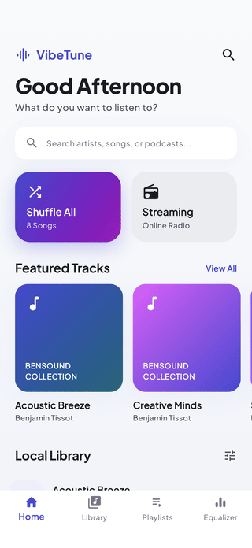
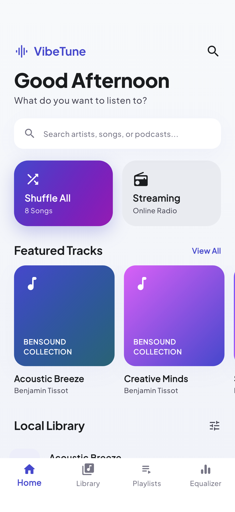
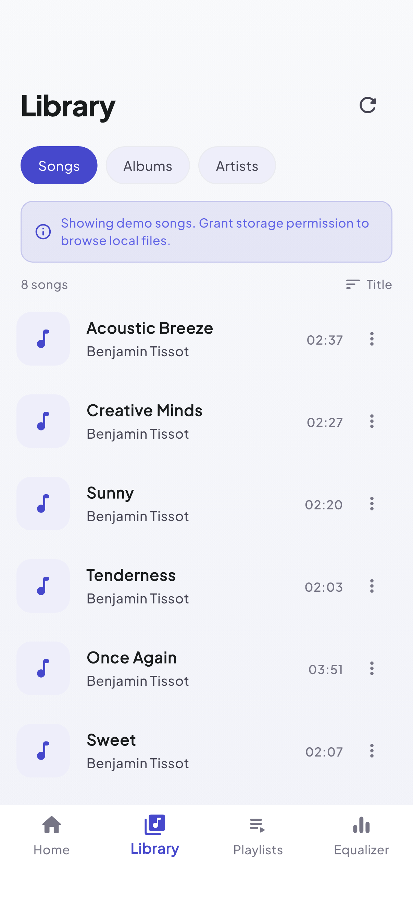
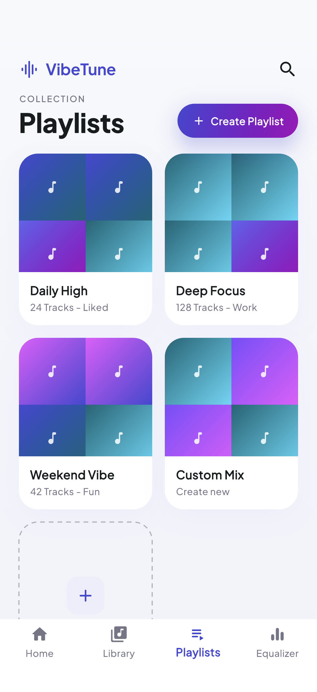
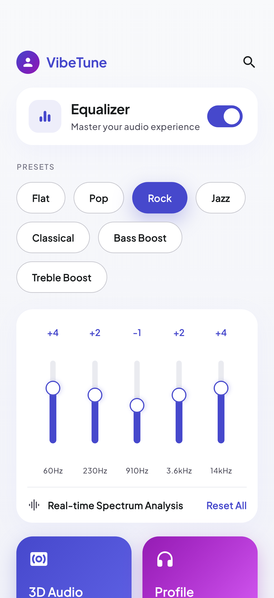
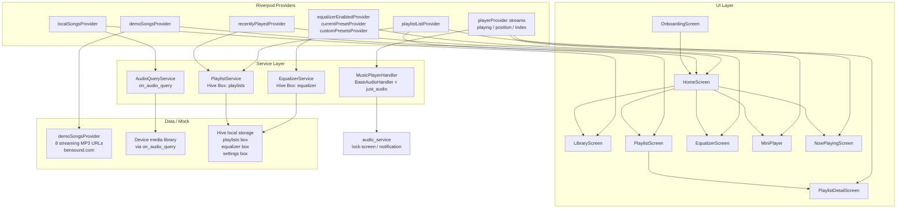

# flutter-music-player

A Flutter music player POC built with **Flutter + Riverpod**, demonstrating audio playback, a browsable song library, playlist management, a 5-band equalizer, and background audio via **audio_service**. It plays both streaming demo tracks (**just_audio**) and local device files (**on_audio_query**), with all state persisted locally using **Hive**.

The UI follows the **"VibeTune / Vivid Sonic"** design system: a bright, airy light theme with an Electric Violet -> Magenta accent gradient, soft colored shadows, fully pill-shaped controls, 24px cards, and **Plus Jakarta Sans** typography. Screens were designed in Google Stitch first, then built to match pixel-for-pixel.

## Demo

Real captures from the iOS Simulator via an integration-test driver (no mockups).



## Screenshots

| Home | Library | Playlists | Equalizer |
|------|---------|-----------|-----------|
|  |  |  |  |

## Features

- Home screen with time-of-day greeting, a search field, Shuffle All / Streaming quick-play cards, a horizontal "Featured Tracks" carousel, and a "Local Library" browse list.
- Four-tab bottom navigation: Home, Library, Playlists, Equalizer.
- Now Playing screen with a floating album-art card, gradient seek bar, play/pause/skip controls, shuffle toggle, loop mode, and an "Up Next" bar.
- Mini-player persistently visible at the bottom of every main screen.
- Library screen with tabs for Songs, Albums, and Artists (queries the device media library via on_audio_query).
- Playlist management - create, rename, delete playlists; drag-to-reorder songs inside a playlist; collage cover art.
- 5-band equalizer (60 Hz, 230 Hz, 910 Hz, 3.6 kHz, 14 kHz) with vertical gradient sliders, 7 built-in presets (Flat, Pop, Rock, Jazz, Classical, Bass Boost, Treble Boost), a master toggle, and "3D Audio" / "Profile" feature cards.
- Background audio with lock-screen controls and media notification via audio_service.
- Onboarding screen shown on first launch; completion state persisted in Hive.
- All playlists, recently played list (max 20), and equalizer state survive app restarts via Hive.

## Stack

- **Flutter + Riverpod** (state management - StateNotifierProvider, StreamProvider, Provider)
- **just_audio** + **audio_service** + **audio_session** (playback pipeline + background audio handler)
- **on_audio_query** (local device media library)
- **Hive / hive_flutter** (local persistence for playlists, recently played, EQ state)
- **rxdart** (combineLatest3 for position/buffered/duration stream)
- **palette_generator** (album art color extraction)
- **google_fonts** (Plus Jakarta Sans type scale)

## Architecture

```
lib/
├── main.dart                  # Bootstrap: Hive init, AudioService.init, ProviderScope
├── app.dart                   # MaterialApp, onboarding gate, AppTheme
├── models/
│   ├── song.dart              # Song value object (toJson / fromJson)
│   ├── playlist.dart          # Playlist value object with song list
│   └── equalizer_preset.dart  # EQ preset value object + 7 built-in presets
├── services/
│   ├── audio_player_service.dart  # MusicPlayerHandler (BaseAudioHandler + just_audio)
│   ├── audio_query_service.dart   # On-device media query via on_audio_query
│   ├── equalizer_service.dart     # EQ state read/write to Hive
│   └── playlist_service.dart      # Playlist + recently-played CRUD in Hive
├── features/
│   ├── home/                  # Home screen + demoSongsProvider + recentlyPlayedProvider
│   ├── player/                # NowPlayingScreen, MiniPlayer, playerProvider (streams)
│   ├── library/               # LibraryScreen (songs/albums/artists tabs), localSongsProvider
│   ├── playlist/              # PlaylistScreen, PlaylistDetailScreen, playlistListProvider
│   └── equalizer/             # EqualizerScreen, equalizerProvider, currentPresetProvider
├── theme/
│   ├── app_theme.dart         # Light Material 3 theme (Vivid Sonic, Plus Jakarta Sans)
│   └── colors.dart            # Vivid Sonic palette + violet->magenta gradients + shadows
└── widgets/
    ├── album_art.dart         # Placeholder / network album art widget
    ├── seek_bar.dart          # Seek bar with position + buffered track
    └── song_tile.dart         # Reusable song row tile
```



## Mock data

The app is fully demoable with no real server and no device music files. Demo tracks live in `lib/features/home/home_provider.dart` as a `demoSongsProvider` (a plain `Provider<List<Song>>`). It returns 8 constant `Song` objects pointing to royalty-free MP3 streams from bensound.com:

| # | Title | Artist | Duration |
|---|-------|--------|----------|
| 1 | Acoustic Breeze | Benjamin Tissot | 2:37 |
| 2 | Creative Minds | Benjamin Tissot | 2:27 |
| 3 | Sunny | Benjamin Tissot | 2:20 |
| 4 | Tenderness | Benjamin Tissot | 2:03 |
| 5 | Once Again | Benjamin Tissot | 3:51 |
| 6 | Sweet | Benjamin Tissot | 2:07 |
| 7 | Love | Benjamin Tissot | 2:12 |
| 8 | Dreams | Benjamin Tissot | 3:30 |

All songs set `isLocal: false`, so `MusicPlayerHandler` loads them as remote URI audio sources via just_audio. The Hive boxes (`playlists`, `equalizer`, `settings`) start empty and are populated by in-app interactions; no seed data is required to launch.

## Run

```bash
flutter pub get
flutter run
```

Requires iOS 14+ or Android 9+ for background audio via audio_service. On iOS, grant media library permission when prompted for the Library tab.
